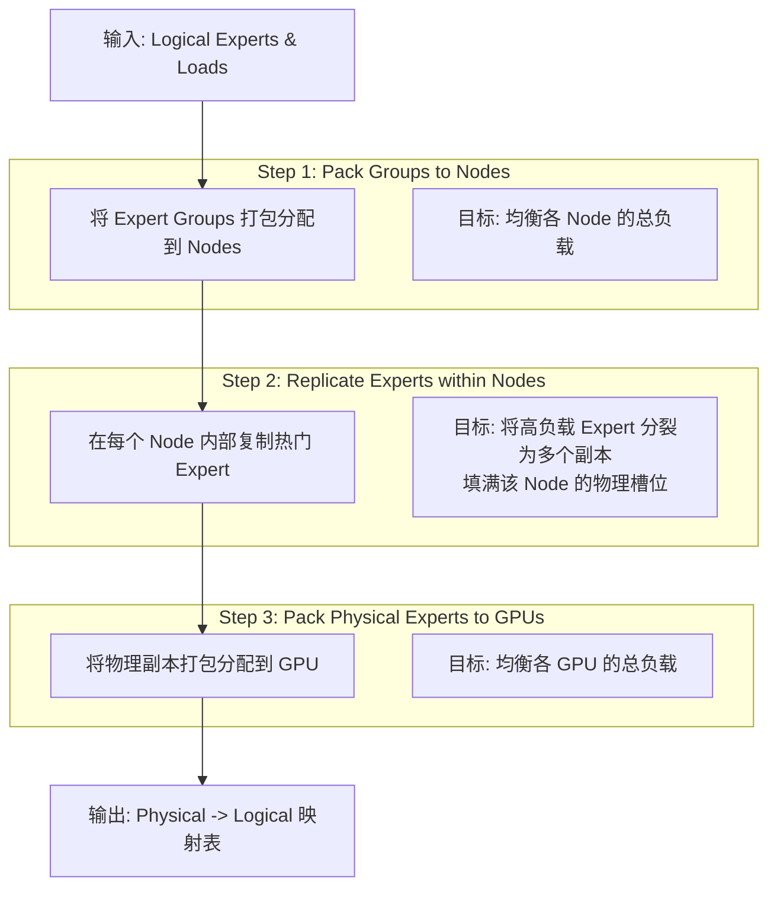
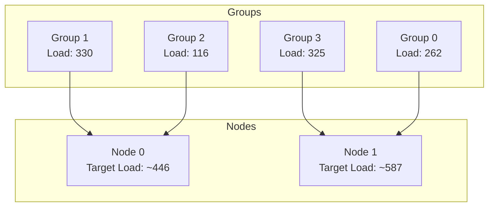
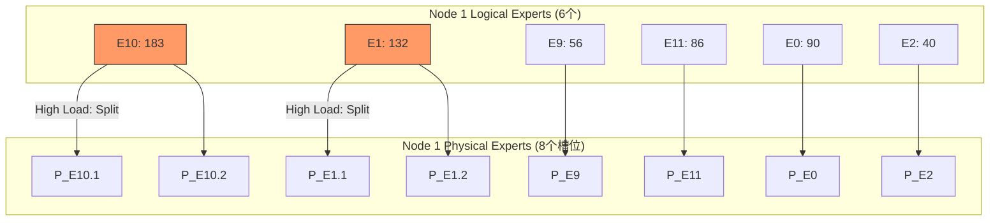
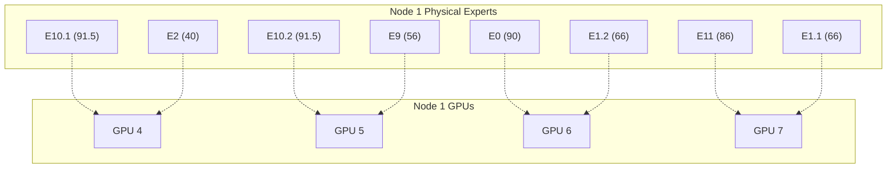

# 解析 EPLB (Expert Parallel Load Balancer) 算法原理

本文基于[deepseek-ai/EPLB](https://github.com/deepseek-ai/EPLB/tree/main)的源码实现，剖析 EPLB 算法的工作原理。

## 什么是 EPLB？

EPLB (Expert Parallel Load Balancer) 是一种用于大规模混合专家模型 (MoE) 的负载均衡算法。它的核心目标是将“逻辑专家”(Logical Experts) 及其负载 (Weight) 映射到“物理副本”(Physical Replicas)，并最终分配到具体的 GPU 上，以实现计算负载的均衡，从而提高并行训练或推理的效率。

对于分层负载均衡 (`rebalance_experts_hierarchical`)，它采用了 **Pack (分组) -> Replicate (复制) -> Pack (再分组)** 的三步策略。

## 核心流程概述

EPLB 的分层策略主要包含以下三个步骤：

## 案例详解

我们结合 `main.py` 中的具体数据来演示这一过程：

*   **Logical Experts**: 12 个 (索引 0-11)
*   **Weight (负载)**: `[90, 132, 40, 61, 104, 165, 39, 4, 73, 56, 183, 86]`
*   **Topology (拓扑)**:
    *   16 Replicas (总物理槽位)
    *   4 Groups (专家分组)
    *   2 Nodes (服务器节点)
    *   8 GPUs (总 GPU 数)

这意味着：
*   每个 Group 包含 `12 / 4 = 3` 个 Logical Experts。
*   每个 Node 拥有 `16 / 2 = 8` 个物理槽位。
*   每个 GPU 拥有 `16 / 8 = 2` 个物理槽位。

### Step 1: Pack Groups to Nodes (组级均衡)

首先，将 12 个专家按顺序分为 4 个 Group，计算每组的总负载，然后利用贪心算法（Balanced Packing）将这 4 个 Group 分配给 2 个 Node，使得两个 Node 的负载尽可能接近。

*   **Group 0 (E0-E2)**: Load = 90+132+40 = 262
*   **Group 1 (E3-E5)**: Load = 61+104+165 = 330
*   **Group 2 (E6-E8)**: Load = 39+4+73 = 116
*   **Group 3 (E9-E11)**: Load = 56+183+86 = 325

分配逻辑（贪心策略）：优先处理大负载 Group。
1.  Node 0: [Group 1 (330)] -> Total: 330
2.  Node 1: [Group 3 (325)] -> Total: 325
3.  Node 1: [Group 3 (325), Group 0 (262)] -> Total: 587
4.  Node 0: [Group 1 (330), Group 2 (116)] -> Total: 446

*(注：实际代码中的 packing 顺序可能略有差异，这里展示的是逻辑过程)*

### Step 2: Construct Redundant Experts (节点内复制)

在确定了每个 Node 负责的 Logical Experts 后，我们需要在 Node 内部进行“复制”操作，将高负载的专家分裂成多个副本，直到填满该 Node 的 8 个物理槽位。

以 **Node 1** 为例，它负责 **Group 0 (E0, E1, E2)** 和 **Group 3 (E9, E10, E11)**。
共 6 个逻辑专家，需要填充 8 个物理槽位，因此需要增加 2 个副本。

**复制过程：**
1.  初始状态：每个专家 1 个副本。
2.  找到当前平均负载最高的专家：**E10 (183)**。
3.  **Split E10**: E10 副本数变为 2，每个副本负载降为 `183 / 2 = 91.5`。
4.  再次寻找最高负载：**E1 (132)**。
5.  **Split E1**: E1 副本数变为 2，每个副本负载降为 `132 / 2 = 66`。
6.  副本总数达到 8，停止。

### Step 3: Pack Physical Experts to GPUs (GPU 级均衡)

最后一步是将 Node 1 内生成的 8 个物理专家（带有拆分后的负载）分配到该 Node 下的 4 个 GPU 上（每个 GPU 2 个槽位）。

这再次使用 `balanced_packing` 算法，确保每个 GPU 处理的计算量尽可能一致。

**Node 1 物理专家负载：**
*   E10.1 (91.5), E10.2 (91.5)
*   E0 (90), E11 (86)
*   E1.1 (66), E1.2 (66)
*   E9 (56), E2 (40)

通过贪心打包，系统会将这些任务分配给 GPU 4, 5, 6, 7。

## 总结

EPLB 算法通过 **Hierarchical Balancing (分层均衡)** 有效解决了 MoE 模型的负载均衡问题：

1.  **Node 间均衡**: 粗粒度分配，适应节点间带宽限制。
2.  **Node 内复制**: 利用高速互联，通过复制热门专家消除热点。
3.  **GPU 间均衡**: 细粒度调度，确保硬件算力不闲置。

最终输出的 `phy2log` 映射表（如 `[5, 6, 5, 7, ...]`）即指导系统：第 0 号物理位置加载 5 号逻辑专家，第 1 号位置加载 6 号专家，以此类推。