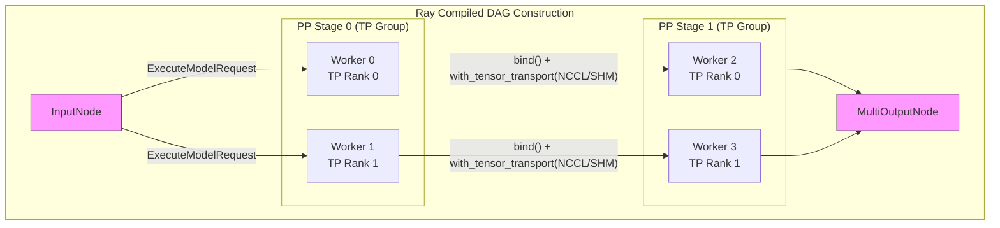
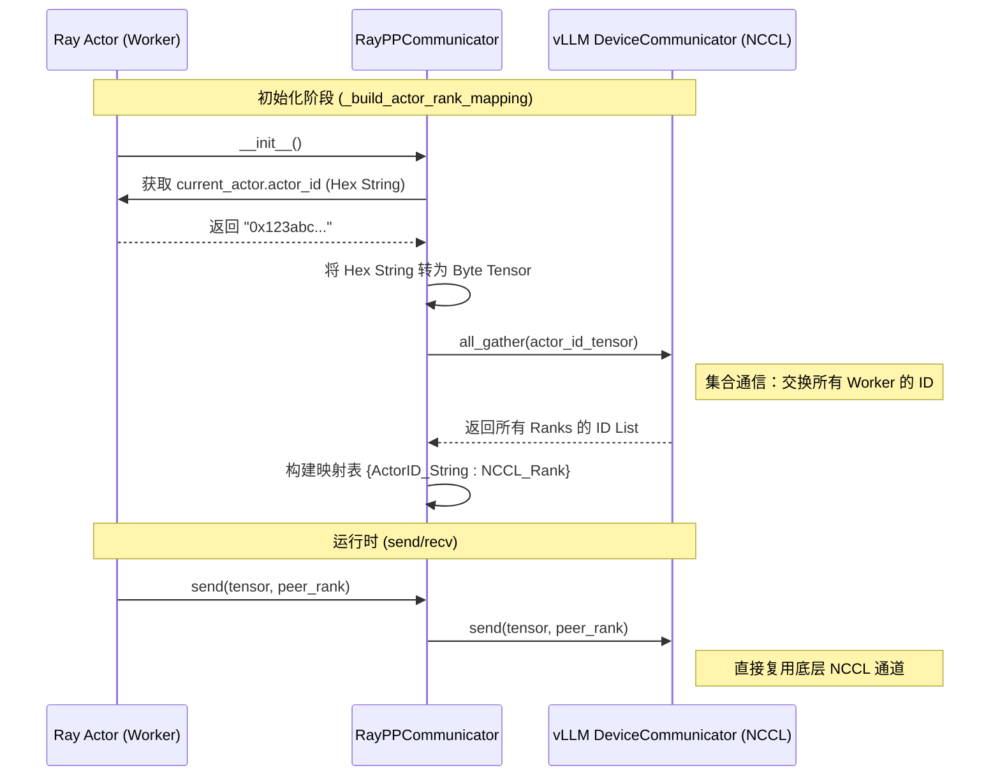
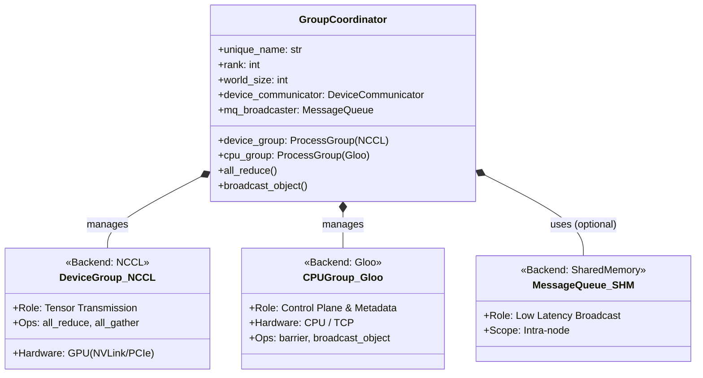

# vLLM 与 Ray 的深度集成：图编译与混合通信架构

在分布式大模型推理中，vLLM 通过深度集成 Ray 框架，利用 **Ray Compiled Graph** 消除 Python 调度开销，并结合自定义的 **RayPPCommunicator** 复用底层高效通信栈。本文深入剖析其代码级的实现逻辑。

## 1. Ray Compiled Graph：静态图构建与 SPMD 执行

在 `vllm/v1/executor/ray_executor.py` 的 `_compiled_ray_dag` 方法中，vLLM 构建了一个静态的计算图。这种设计避免了每次推理时动态创建任务的开销。

### 1.1 DAG 构建流程

代码逻辑采用了 **SPMD (Single Program, Multiple Data)** 模式。
*   **输入共享**：第一组 TP (Tensor Parallel) Workers 共享同一个 `InputNode`。
*   **流水线传递**：每一级 PP (Pipeline Parallel) 的输出通过 `bind` 操作成为下一级的输入。
*   **传输优化**：通过 `with_tensor_transport` 显式指定通信通道（如 NCCL 或 SHM）。

**关键代码映射**：
*   `outputs = [input_data for _ in self.pp_tp_workers[0]]`: 对应图中 Input 到 PP Stage 0 的连接。
*   `worker.execute_model_ray.bind(outputs[i])`: 对应图中 Stage 间的连接。
*   `output.with_tensor_transport(transport=...)`: 对应图中连接线上的传输协议配置。

## 2. RayPPCommunicator：动态 Rank 映射机制

Ray 的调度基于 128 位的 Actor ID（十六进制字符串），而底层 NCCL 通信依赖整数 Rank。`vllm/distributed/device_communicators/ray_communicator.py` 中的 `RayPPCommunicator` 类解决了这一映射问题。

### 2.1 适配器架构与 Rank 发现

`RayPPCommunicator` 并不创建新的通信连接，而是作为 vLLM 内部 `_PP` 组（Pipeline Parallel Group）的包装器。它必须在初始化阶段建立 Actor ID 到 NCCL Rank 的映射。

**实现细节**：
*   **Rank 来源**：`self._rank = self._comm.rank_in_group`，强制使用 vLLM 内部的 Rank，忽略 Ray 传入的 rank 参数。
*   **映射构建**：`_build_actor_rank_mapping` 函数将 32 字节的 Actor ID 转换成 `torch.uint8` 张量，通过 `_comm.all_gather` 在所有 Worker 间交换，从而让每个 Worker 知道其他 Actor ID 对应的 Rank 是多少。

## 3. GroupCoordinator：双通道通信基石

vLLM 的分布式状态核心位于 `vllm/distributed/parallel_state.py` 中的 `GroupCoordinator`。它采用双层通信架构，确保了数据传输的高带宽和控制流的低延迟。

### 3.1 双层通信架构图

**代码级设计解析**：

1.  **初始化 (`__init__`)**：
    *   `device_group = torch.distributed.new_group(..., backend=backend)`: 创建 NCCL 组，用于 `all_reduce` 等重型 Tensor 操作。
    *   `cpu_group = torch.distributed.new_group(..., backend="gloo")`: 创建 Gloo 组，用于 `barrier`、`broadcast_object` 等轻量级控制操作。这一步使用了 `suppress_stdout` 来避免冗余日志。

2.  **分层调用**：
    *   调用 `all_reduce(tensor)` 时，请求被转发给 `device_communicator`，最终走 NCCL 通道。
    *   调用 `broadcast_object(obj)` 时，优先尝试 `mq_broadcaster` (共享内存)，如果不可用则回退到 `cpu_group` (Gloo)。

3.  **全局状态管理**：
    *   `_TP`, `_PP`, `_DP` 等全局变量本质上都是 `GroupCoordinator` 的实例。
    *   `init_model_parallel_group` 工厂函数负责根据 Rank 列表实例化这些协调器。

## 4. 总结

vLLM 的分布式架构并非简单的堆砌，而是针对不同通信需求做了精细的分层：
*   **计算层**：利用 Ray Compiled Graph 实现静态图优化和 SPMD 执行。
*   **调度适配层**：通过 `RayPPCommunicator` 的动态 Rank 映射，解决 Ray Actor 与 NCCL Rank 的寻址差异。
*   **通信基底层**：`GroupCoordinator` 提供的双通道（NCCL + Gloo/SHM）机制，保证了数据面和控制面的隔离与高效。